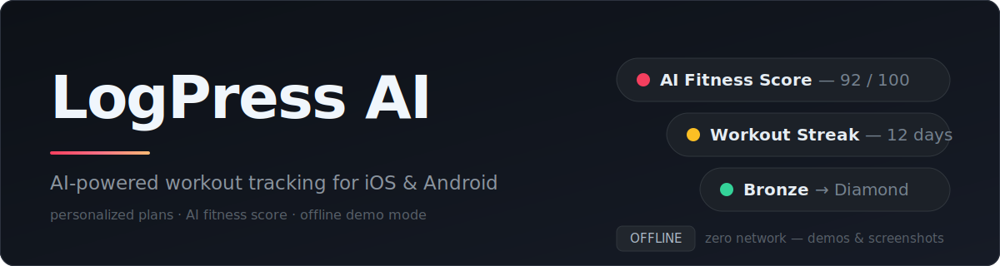
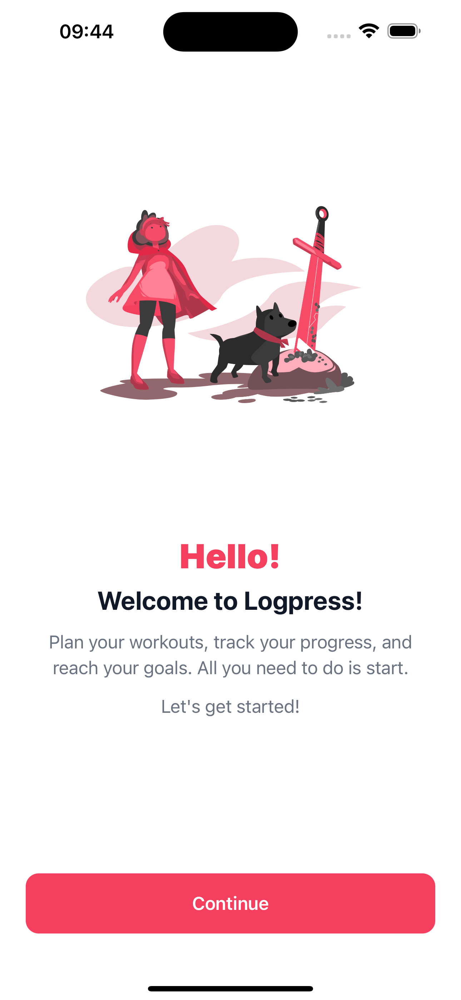
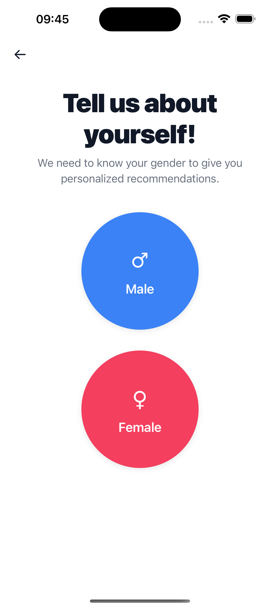
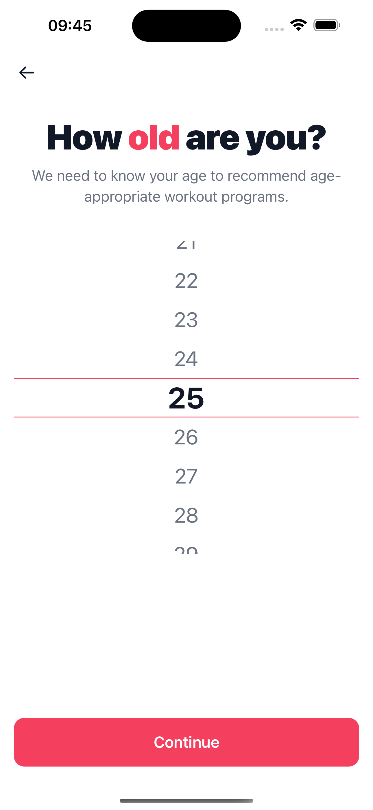
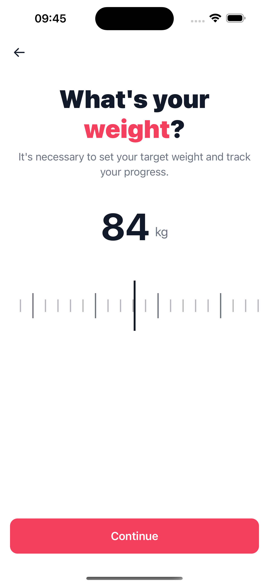
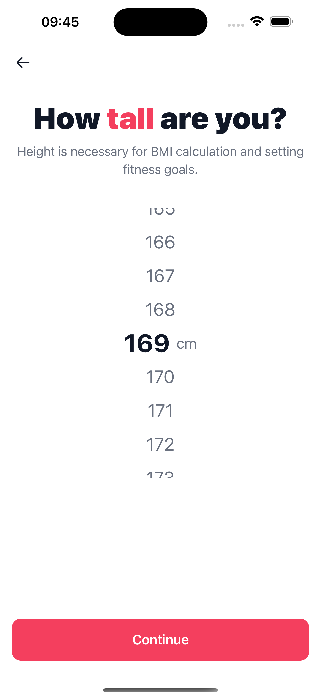
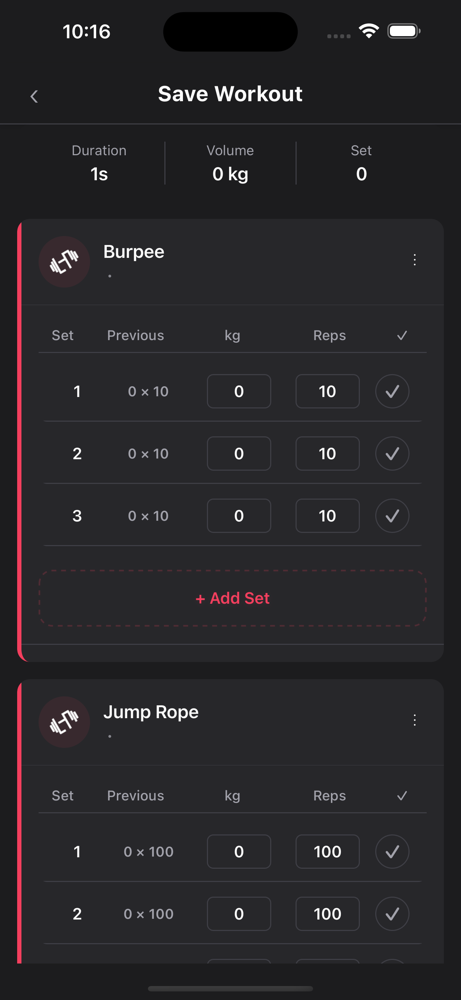
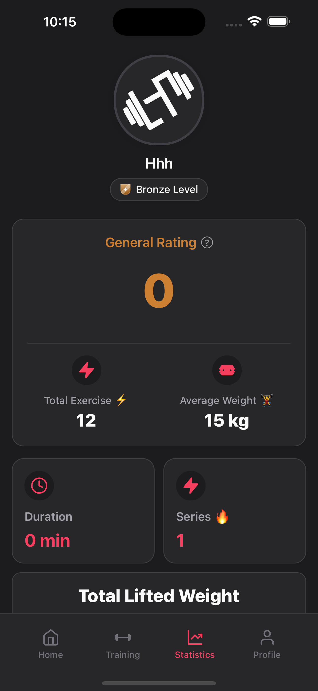

<p align="center">
  
</p>

<p align="center">
  
  
  
  
  
</p>

A React Native fitness app that plans workouts, logs sets and reps, and turns your training history into an AI-generated fitness score. This is the **public, sanitized** version of the app — no embedded API keys or Firebase config, ready to run with your own.

## Screenshots

**Onboarding** — a short flow that personalizes the setup:

<table align="center">
  <tr>
    <td align="center"><br/><sub><b>Welcome</b></sub></td>
    <td align="center"><br/><sub><b>Gender</b></sub></td>
    <td align="center"><br/><sub><b>Age</b></sub></td>
    <td align="center"><br/><sub><b>Weight</b></sub></td>
    <td align="center"><br/><sub><b>Height</b></sub></td>
  </tr>
</table>

**In the app** — workout logging and statistics, dark theme:

<table align="center">
  <tr>
    <td align="center"><br/><sub><b>Log a Workout</b></sub></td>
    <td align="center"><br/><sub><b>Statistics</b></sub></td>
  </tr>
</table>

## Features

- **Personalized onboarding** — gender, age, weight & height feed a tailored setup.
- **AI fitness score** — workout history analyzed by OpenAI into a score and a progress plan.
- **Workout logging** — build routines, track sets, reps and weight, keep full history.
- **Statistics** — general rating, total volume, weekly activity and progress charts.
- **Gamification** — points, badges and a leaderboard from Bronze up.
- **Premium / paywall** — subscription management via Adapty.
- **Localization** — multi-language support with i18next.
- **Light & dark themes.**

## Tech Stack

| Layer | Technology |
|---|---|
| Framework | React Native 0.80 · React 19 · TypeScript |
| State | Redux Toolkit · React Redux |
| Navigation | React Navigation 7 (native-stack) |
| Backend / Auth | Supabase |
| AI | OpenAI API |
| Subscriptions | Adapty |
| Analytics | Firebase Analytics |
| UI | styled-components · Lottie · react-native-svg · react-native-video |
| i18n | i18next · react-i18next |

## Getting Started

> This is the public / sanitized version of the app. It ships without real API keys or Firebase config — bring your own to run it.

### 1. Install dependencies

```sh
npm install
cd ios && bundle install && bundle exec pod install && cd ..
```

### 2. Configure environment

```sh
cp .env.example .env
```

Fill in `.env` with your own keys:

| Variable | Where to get it |
|---|---|
| `OPENAI_API_KEY` | https://platform.openai.com/api-keys |
| `ADAPTY_API_KEY` | https://app.adapty.io (starts with `public_live_`) |
| `SUPABASE_URL` | https://supabase.com → Project Settings → API |
| `SUPABASE_ANON_KEY` | https://supabase.com → Project Settings → API |

### 3. Firebase (analytics)

- **iOS** — create an iOS app in your Firebase project, download `GoogleService-Info.plist`, drop it into `ios/`. (Template: `ios/GoogleService-Info.plist.example`)
- **Android** — download `google-services.json` into `android/app/`.

### 4. iOS signing

- Open `ios/logpressai.xcworkspace` in Xcode → Targets → logpressai → **Signing & Capabilities** → select your Apple Developer Team.
- Change the Bundle Identifier to your own (current: `com.logpress.app`).

### 5. Run

```sh
npm start          # Metro bundler
npm run ios        # or
npm run android
```

## Offline / Demo Mode

Run the app with no backend and no internet — demos, App Store screenshots, offline use. Flip a single switch:

```ts
// src/config/offline.ts
export const OFFLINE_MODE = true;
```

When enabled, the app makes zero network requests: Supabase (auth + all queries), Adapty, Firebase Analytics and OpenAI calls are all short-circuited. Paywall screens show mock products, and "Buy Premium" succeeds instantly (no real payment). Set it back to `false` and rebuild to go online.

## Troubleshooting

- **`fmt` / `consteval` build error on iOS (Xcode 16.3+ / 26)** — the `post_install` hook in `ios/Podfile` auto-patches `Pods/fmt/include/fmt/base.h` (`FMT_USE_CONSTEVAL=0`). Re-run `bundle exec pod install` and build again.
- General React Native issues: https://reactnative.dev/docs/troubleshooting

## Contributing

Issues and pull requests are welcome.

## License

Released under the [MIT License](LICENSE).
